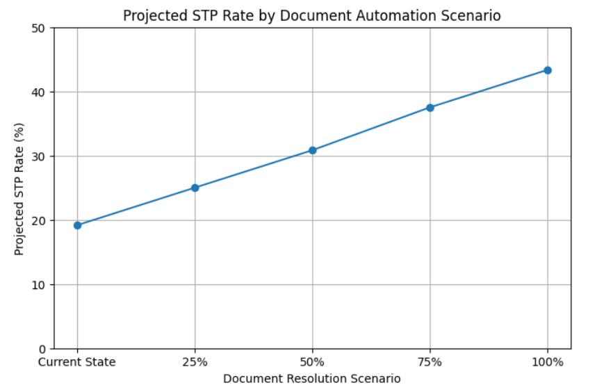

# KYB Onboarding STP Risk Scoring & Decision Engine

**Current STP rate: 19.17% | Theoretical STP opportunity: 43.33% | Potential handling-time reduction: 22.63%**

## Overview

This project simulates an end-to-end fintech KYB onboarding workflow and demonstrates how manual onboarding processes can be redesigned into a scalable, decision-driven Straight-Through Processing (STP) model.

Using Python and SQL, the project combines:

* Synthetic KYB data generation
* Document verification and completeness checks
* Rule-based risk scoring
* Decision-engine logic
* Exception routing
* Workflow simulation
* SQL-based bottleneck analysis
* Document automation scenario modelling
* Operational capacity-savings analysis
* Executive KPI reporting

The project is designed from a **system and operating-model perspective**, rather than purely as a data analysis exercise.

It demonstrates how customer data, documents, screening indicators and risk signals can flow through a structured decision engine that routes cases into:

**STP Auto-Approval → Request Information → Manual Review → Enhanced Review → Reject**

The objective is to show how KYB operations can move from full manual case handling toward **exception-based processing**, where automation handles low-risk, complete cases and analyst capacity is focused on cases requiring judgement, remediation or escalation.

---

## Business Problem

KYB onboarding teams often face delays caused by:

* Incomplete or poor-quality documentation
* Complex ownership and UBO structures
* High-risk jurisdictions
* Screening and risk indicators
* Repeated request-for-information cycles
* Manual review queues
* Limited visibility into the true source of operational workload

As onboarding volumes scale, treating every case through the same manual workflow creates avoidable bottlenecks and consumes analyst capacity.

A key question for onboarding teams is therefore not simply:

> **How much of onboarding can be automated?**

The more useful questions are:

> **Which cases are preventing STP, why are they failing, and where should automation investment be prioritised?**

This project addresses those questions through risk-based decisioning, exception analysis and operational scenario modelling.

---

## Project Objectives

The project aims to:

* Simulate an end-to-end KYB onboarding workflow
* Model customer, document, screening and risk inputs
* Build explainable rule-based risk scoring logic
* Design a decision engine for STP and exception routing
* Analyse onboarding turnaround time using SQL
* Identify workflow bottlenecks by stage and risk level
* Separate document-driven friction from risk-driven review
* Model the impact of improved document automation
* Estimate potential analyst capacity savings
* Consolidate findings into an executive KPI view

---

## System Design

The workflow is designed as a decision-driven onboarding architecture.

### Inputs

* Customer profile data
* Jurisdiction
* Industry
* Entity type
* Ownership complexity
* Source-of-funds risk
* Expected transaction activity
* KYB documents
* Screening indicators
* Risk flags

### Processing

* Data validation
* Document completeness checks
* Document verification
* Rule-based risk scoring
* Risk-band classification
* Decision-engine execution
* Exception routing
* Workflow simulation
* Operational performance analysis

### Outputs

* STP Auto-Approval
* Request Information
* Manual Review
* Enhanced Review
* Reject

This reflects how modern onboarding systems are evolving from fully manual case handling toward structured, exception-based workflows where decision logic is embedded directly into the process.

---

## Workflow Simulated

The onboarding pipeline includes:

1. Application Submitted
2. Documents Requested
3. Documents Received
4. Screening Completed
5. Analyst Review
6. Compliance Review
7. Approved / Rejected

Higher-risk customers are simulated to require greater intervention and longer processing times.

The workflow allows operational performance to be analysed across:

* Customer risk level
* Workflow stage
* Decision outcome
* Exception type
* Processing delay

---

## Risk Logic

The rule-based risk model evaluates escalation drivers including:

* High-risk jurisdiction
* Complex ownership structure
* Elevated source-of-funds risk
* PEP exposure
* Sanctions indicators
* Adverse media
* High expected transaction activity
* Incomplete or unverified mandatory documents

These signals are used to create risk scores, assign risk bands and support onboarding decisions.

The synthetic relationships are scenario-based assumptions created for system and workflow testing. They do not represent actual customer risk rates.

---

## Decision Engine & Exception Routing

The decision engine routes customers according to a defined priority order.

### Reject

Cases with hard-stop triggers such as sanctions indicators.

### Request Information

Cases with incomplete, pending or rejected mandatory KYB documents.

### Enhanced Review

Higher-risk customers requiring additional due diligence or escalation.

### Manual Review

Medium-risk customers requiring analyst judgement.

### STP Auto-Approval

Low-risk customers with complete and verified mandatory documentation.

This creates an exception-based operating model where analysts do not review every customer manually.

Instead, operational effort is directed toward cases requiring:

* Document remediation
* Risk assessment
* Enhanced due diligence
* Escalation
* Judgement

---

## Example Decision Logic

```python
def decision_engine(row):
    if row["sanctions_flag"] == 1:
        return "Reject"

    elif row["document_complete"] == 0:
        return "Request Information"

    elif row["risk_band"] == "High":
        return "Enhanced Review"

    elif row["risk_band"] == "Medium":
        return "Manual Review"

    else:
        return "STP Auto Approve"
```

The routing order is important.

Document completeness is assessed before normal risk-band routing because a customer cannot proceed to final approval or review without the required KYB documentation.

Once document issues are resolved, the case can be re-assessed and routed according to its remaining risk profile.

---

## Current-State STP Performance

The current decision engine achieves:

| Metric                                 | Result |
| -------------------------------------- | -----: |
| Simulated customers                    |    120 |
| STP auto-approved customers            |     23 |
| Current STP rate                       | 19.17% |
| Customers requiring exception handling |     97 |
| Exception rate                         | 80.83% |

The current STP rate is deliberately constrained by both risk and document-readiness requirements.

Only customers that are:

* Low risk
* Free from hard-stop indicators
* Complete in mandatory documentation
* Successfully verified

are eligible for automatic approval.

This produces a more realistic view of STP than assuming all low-risk customers can be automated immediately.

---

## What Is Actually Preventing STP?

The exception analysis identifies a major operational finding:

| Exception Type             | Share of Exception Workload |
| -------------------------- | --------------------------: |
| Document-driven exceptions |                      90.72% |
| Risk-driven review         |                       7.22% |
| Hard-stop exceptions       |                       2.06% |

The largest constraint on STP is therefore **not elevated customer risk**.

It is **document readiness**.

Most exception cases are generated because mandatory documents are:

* Missing
* Pending verification
* Rejected
* Not fully complete

This distinction is operationally important because document-driven and risk-driven cases require different solutions.

### Document-driven friction requires:

* Better collection journeys
* Automated completeness checks
* Document validation
* Targeted request-for-information workflows
* Improved verification processes

### Risk-driven exceptions require:

* Analyst judgement
* Enhanced due diligence
* Escalation
* Compliance review

Separating these workloads allows onboarding teams to design different queues, service levels and automation strategies.

---

## Low-Risk Automation Opportunity

The analysis identifies:

* 23 low-risk customers already eligible for STP
* 29 additional low-risk customers blocked only by document issues

This creates a theoretical automation pool of:

**52 out of 120 customers**

If document-related friction were fully resolved, the theoretical STP rate could increase from:

**19.17% → 43.33%**

This represents a:

**+24.17 percentage-point uplift**

The result shows that significant STP improvement may be achieved without automating increasingly complex risk decisions.

A major opportunity exists upstream through better document collection, validation and verification.

---

## Document Automation Scenario Analysis

The project models four future-state scenarios based on the proportion of low-risk document exceptions successfully resolved.

| Document Exceptions Resolved | Projected STP Rate |
| ---------------------------- | -----------------: |
| Current state                |             19.17% |
| 25% resolved                 |             25.00% |
| 50% resolved                 |             30.83% |
| 75% resolved                 |             37.50% |
| 100% resolved                |             43.33% |



**Figure: Projected STP rate under document automation scenarios**

Progressively resolving low-risk document exceptions could increase the projected STP rate from **19.17%** in the current state to **43.33%** under the full-resolution scenario.

The scenario analysis demonstrates that operational improvement does not require the complete elimination of document friction. Incremental improvements can progressively:

* Increase STP
* Reduce exception volumes
* Lower manual handling
* Release analyst capacity

These scenarios represent modelled outcomes rather than guaranteed production results.

---

## Operational Capacity Analysis

The project translates STP improvement into estimated operational handling-time savings.

Illustrative handling-time assumptions are assigned to each onboarding outcome:

* STP Auto-Approval
* Request Information
* Manual Review
* Enhanced Review
* Reject

The model shows that request-for-information handling is the largest source of aggregate operational effort because of its high case volume.

### Current-State Estimated Effort

| Metric                        |      Result |
| ----------------------------- | ----------: |
| Total estimated handling time | 85.42 hours |
| Request Information workload  | 66.00 hours |
| Manual Review workload        |  7.50 hours |
| Enhanced Review workload      |  6.00 hours |
| Reject handling               |  4.00 hours |
| STP handling                  |  1.92 hours |

Although enhanced review requires more effort per individual case, document-related remediation creates the largest total capacity burden.

This demonstrates why automating only complex review activities may produce limited overall benefits if high-volume document friction remains unresolved.

---

## Capacity-Savings Scenarios

As document-driven friction is reduced, the model estimates the following operational savings:

| Scenario                                     | Estimated Capacity Saved |
| -------------------------------------------- | -----------------------: |
| 25% of low-risk document exceptions resolved |               4.67 hours |
| 50% resolved                                 |               9.33 hours |
| 75% resolved                                 |              14.67 hours |
| 100% resolved                                |              19.33 hours |

Under the full-resolution scenario:

* Total handling effort falls from **85.42 hours to 66.08 hours**
* Estimated capacity savings reach **19.33 hours**
* Total operational handling time falls by **22.63%**

The released capacity could be redirected toward:

* Higher-risk customers
* Complex ownership structures
* Enhanced due diligence
* Escalations
* Cases requiring analyst judgement

---

## Workflow Bottleneck Analysis

SQL is used to analyse stage-level processing delays across risk bands.

The simulation shows that higher-risk customers experience longer delays across multiple workflow stages.

Examples include:

* High-risk document request stage: **4.62 days**
* High-risk analyst review stage: **4.15 days**
* High-risk document receipt stage: **4.00 days**

Medium-risk customers generally experience delays of approximately **2.5 to 2.9 days**, while low-risk customers progress in approximately **1.9 to 2.3 days**.

The analysis suggests that higher-risk cases consume more processing time across the entire onboarding journey rather than creating delay at only one isolated stage.

This supports:

* Early risk identification
* Differentiated service levels
* Risk-based queue prioritisation
* Exception-based capacity allocation

---

## Operational KPI Summary

The project consolidates the main decision-engine, STP and capacity-model outputs into an executive KPI view.

Key measures include:

* Current STP rate
* Current exception rate
* Document-driven exception share
* Risk-driven exception share
* Theoretical STP opportunity
* Potential STP uplift
* Current operational handling effort
* Potential capacity savings
* Potential handling-time reduction

This provides a management-level view that can support:

* Automation prioritisation
* Process redesign
* Resource allocation
* Operating-model discussions
* Business-case development

---

## Tech Stack

* Python
* Pandas
* NumPy
* SQL
* SQLite
* Jupyter Notebook

---

## Key Analysis Performed

### 1. Synthetic Data Generation

Generated customer, document, screening and workflow datasets for 120 simulated KYB onboarding cases.

### 2. Document Verification

Modelled verified, pending and rejected mandatory KYB documents.

### 3. Risk Scoring

Applied explainable rule-based risk flags and risk-band classification.

### 4. Workflow Simulation

Modelled onboarding stages, processing delays and customer outcomes.

### 5. SQL-Based Operational Analysis

Measured:

* Onboarding turnaround time
* Risk versus processing delay
* Stage-level bottlenecks
* Workflow progression

### 6. Decision Engine

Applied structured routing for:

* STP Auto-Approval
* Request Information
* Manual Review
* Enhanced Review
* Reject

### 7. Exception Analysis

Separated operational workload into:

* Document-driven friction
* Risk-driven review
* Hard-stop exceptions

### 8. Future-State Scenario Modelling

Estimated how incremental improvements in document automation could increase STP.

### 9. Capacity-Savings Analysis

Translated automation scenarios into estimated reductions in manual handling effort.

### 10. Executive KPI Reporting

Consolidated operational findings into a management-level summary.

---

## Key Findings

* The current STP rate is **19.17%**
* **90.72% of exception workload is document-driven**
* Only **7.22% of exceptions are directly risk-driven**
* All 29 low-risk exception cases are blocked by document issues
* The theoretical STP opportunity is **43.33%**
* Resolving document friction could create a **24.17 percentage-point STP uplift**
* Full resolution of low-risk document exceptions could save **19.33 handling hours**
* Total estimated operational effort could fall by **22.63%**
* Higher-risk customers experience longer delays across multiple workflow stages
* Upstream document automation may deliver greater capacity benefits than focusing only on downstream risk review

---

## Business Impact

In a fully manual onboarding model, analyst capacity is consumed across all cases regardless of risk or document readiness.

In the simulated future-state model:

* Low-risk, complete customers can move through STP
* Document issues are routed into targeted remediation workflows
* Medium-risk cases are directed to manual review
* High-risk cases receive enhanced review
* Hard-stop cases are rejected
* Analyst capacity is reserved for work requiring judgement

The project demonstrates how onboarding operations can shift from:

**Review every case**

to:

**Automate standard cases and manage exceptions**

The operational analysis also shows that automation priorities should be based on workload evidence.

In this simulation, the largest opportunity is not simply better risk scoring. It is reducing the high-volume document friction that prevents otherwise low-risk customers from reaching STP.

---

## Evolution Towards AI-Enabled Onboarding

The current system uses rule-based logic because it provides:

* Explainability
* Control
* Auditability
* Clear decision paths

However, the architecture can evolve into a hybrid AI-enabled onboarding platform.

Potential enhancements include:

* LLM-based document validation and summarisation
* Intelligent document classification and extraction
* AI-assisted UBO structure interpretation
* Automated request-for-information generation
* Intelligent explanation of onboarding decisions
* Predictive exception prioritisation
* AI-assisted analyst case summaries
* Agentic workflows for multi-step onboarding checks

A future-state architecture could combine:

**Rules + Workflow Automation + Document Intelligence + Predictive Models + GenAI Assistance**

The objective would not be to replace controlled decisioning, but to use AI where it can reduce operational friction, improve information processing and support analyst judgement.

---

## Real-World Applications

The model can be extended to:

* KYB onboarding automation platforms
* Digital bank onboarding
* Fintech merchant onboarding
* Partner onboarding for embedded finance
* API-driven onboarding decision engines
* Real-time risk scoring
* Compliance workflow orchestration
* Intelligent document processing
* AI-assisted case management

---

## Model Scope & Limitations

This project uses synthetic data and scenario-based assumptions for educational and portfolio demonstration purposes.

The results should not be interpreted as production benchmarks or real-world customer risk rates.

The STP and capacity-savings scenarios assume that resolved low-risk document exceptions satisfy the remaining decision rules and do not develop new risk or screening issues.

In a production environment, final STP eligibility would also depend on:

* Internal policy requirements
* Regulatory obligations
* Data quality
* Screening performance
* Model governance
* Control frameworks
* Human oversight requirements

---

## Conclusion

This project demonstrates how a KYB onboarding workflow can be redesigned into a decision-driven operating model using Python, SQL and rule-based automation.

The analysis shows that the current STP rate is **19.17%**, but the larger operational opportunity lies in understanding why customers fail to reach STP.

Document-related issues account for **90.72% of exception workload**, making upstream document collection, validation and verification the largest automation opportunity in the simulated workflow.

If all low-risk document exceptions were successfully resolved, the model estimates that:

* STP could increase to **43.33%**
* The STP rate could improve by **24.17 percentage points**
* **19.33 hours** of operational capacity could be released
* Total estimated handling effort could fall by **22.63%**

Overall, the project demonstrates a practical progression from:

**Manual onboarding → Rule-based decisioning → Exception-based processing → Scenario modelling → Capacity optimisation → AI-enabled operating model**

The result is not simply a risk-scoring model, but an end-to-end demonstration of how data, decision logic and operational analysis can be combined to redesign KYB onboarding workflows.

