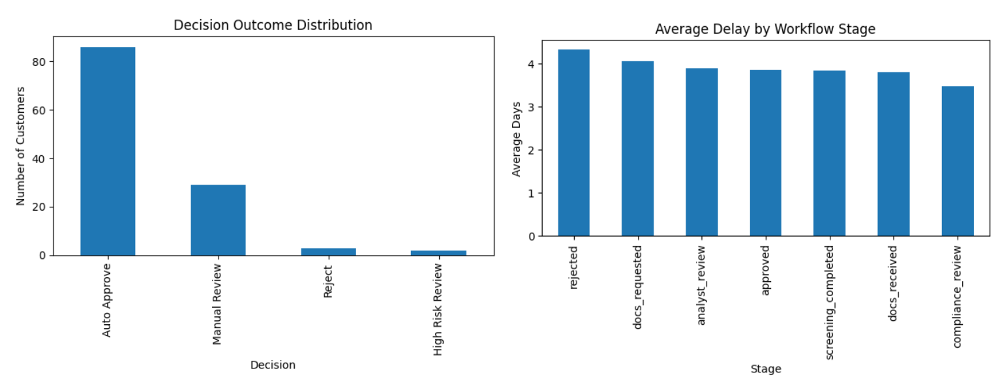

# KYB Onboarding STP Risk Scoring Engine

**Estimated STP rate: ~72%, demonstrating potential to reduce manual onboarding workload by ~70% through rule-based decisioning.**

---

## 🚀 Overview
This project simulates a fintech KYB onboarding workflow and demonstrates how manual onboarding processes can be transformed into a scalable, data-driven STP system.

Using Python and SQL, the project combines:
- Risk scoring  
- Decision engine logic  
- Exception routing  
- Workflow simulation  
- Operational performance analysis  

to identify onboarding bottlenecks and propose automation opportunities.

This project is designed for fintech onboarding, KYB operations, and risk/product teams.

---

## 🧠 Business Problem
KYB onboarding teams often face delays due to:
- Incomplete or poor-quality documentation  
- Complex ownership (UBO) structures  
- High-risk jurisdictions  
- Manual review queues  

As onboarding volumes scale, these issues reduce turnaround speed and create operational bottlenecks.

This project demonstrates how onboarding workflows can be redesigned into scalable, rule-based STP systems using:
- Rule-based decision logic  
- Risk-based prioritisation  
- Exception-driven processing  

---

## 🎯 Project Objectives
- Simulate an end-to-end KYB onboarding workflow  
- Build rule-based risk scoring logic  
- Analyse onboarding turnaround time using SQL  
- Identify workflow bottlenecks and delays  
- Design a decision engine for STP vs manual review  
- Demonstrate how automation improves operational efficiency  

---

## 🔄 Workflow Simulated
The onboarding pipeline includes:

1. Application Submitted  
2. Documents Requested  
3. Documents Received  
4. Screening Completed  
5. Analyst Review  
6. Compliance Review  
7. Approved / Rejected  

Higher-risk customers are simulated to require more manual intervention and longer processing time.

---

## ⚠️ Risk Logic
Rule-based risk flags include:
- High-risk jurisdiction  
- Complex UBO structure  
- High expected transaction volume  
- Adverse media  
- Incomplete documentation  

These drive onboarding complexity and decision outcomes.

---

## ⚙️ Decision Engine & STP Simulation
A rule-based decision engine routes onboarding cases into:

- **Auto Approve** → Low-risk (eligible for STP)  
- **Manual Review** → Moderate risk  
- **High Risk Review** → Enhanced due diligence required  
- **Reject** → Critical risk triggers (e.g. sanctions)  

This reflects how onboarding teams shift from full manual processing to **exception-based handling**.

---

## 📊 STP Performance Metrics



*Figure: Decision outcome distribution (left) highlighting STP vs manual segmentation, and average onboarding delay by workflow stage (right) showing onboarding bottlenecks*

👉 Majority of customers fall into Auto Approve (~72%), while delays are concentrated in document collection and review stages.

| Metric | Value |
|------|------|
| STP Rate | **~71.67%** |
| Manual Review | **~24.17%** |
| High Risk Review | ~2.83% |
| Reject Rate | ~1.33% |

👉 Demonstrates strong potential to reduce manual workload and significantly improve onboarding efficiency through STP.

---

## 🛠 Tech Stack
- Python (Pandas, NumPy)  
- SQL (SQLite)  
- Jupyter Notebook  

---

## 📈 Key Analysis Performed

### 1. Data Simulation
- Generated synthetic KYB customer, document, and workflow datasets  

### 2. Risk Scoring
- Applied rule-based flags to simulate onboarding risk  

### 3. Workflow Simulation
- Modelled onboarding stages, delays, and outcomes  

### 4. SQL-Based Analysis
Measured:
- Onboarding turnaround time  
- Risk vs processing delay correlation  
- Stage-level bottlenecks  

### 5. Decision Engine
- Applied rule-based classification for STP vs manual handling  

---

## 🔍 Key Findings

- Higher-risk customers experience significantly longer onboarding times  
- Document collection and analyst review are key bottlenecks  
- Manual review cases take ~30% longer than auto-approved cases  
- Majority of customers (~72%) can be processed via STP  
- Early risk identification and document validation can improve throughput  

---

## 📉 Operational Insights

- **Manual review ≈ 29 days average onboarding time**  
- **Auto-approved ≈ 20 days average onboarding time**

👉 Demonstrates measurable efficiency gains from automation

---

## 🧠 Business Impact

In a fully manual onboarding model:
- All cases require analyst review  

With rule-based decisioning:
- ~70% of cases can be automated  
- Teams can focus on high-risk exceptions  
- Overall onboarding time is reduced  

---

## 🔮 Real-World Application

This model can be extended to:
- KYB onboarding automation platforms  
- Partner onboarding workflows (embedded finance)  
- API-driven onboarding decision engines  
- Real-time risk scoring systems  

---

## 🧩 Example Decision Logic

```python
def decision_engine(row):
    if row["sanctions_flag"] == 1:
        return "Reject"
    elif row["pep_flag"] == 1 and row["ownership_complexity"] == "High":
        return "High Risk Review"
    elif row["num_flags"] >= 3:
        return "Manual Review"
    else:
        return "Auto Approve"
